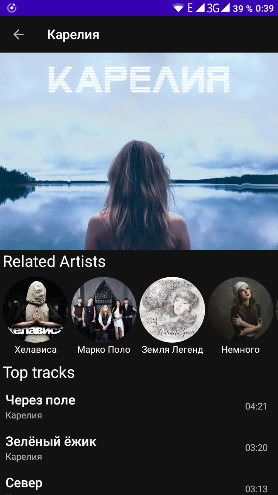

# SpotifyBrowser

Android app that uses Spotify API to show categories, albums, new releases, etc.

Android приложение для просмотра данных сервиса Spotify с
использованием [API](https://developer.spotify.com/documentation/web-api/reference/).

## Стек технологий Android приложения

* Код написан на Kotlin
* Архитектура MVVM
* Dependency injection - Dagger 2
* Для асинхронных операций использованы Coroutines, Flow, StateFlow
* Для загрузки данных использованы библиотеки Retrofit 2 и Paging 3

## Реализовано

* Аутентификация пользователя с использованием OAuth 2.0 через WebView.
  Подробнее [тут](https://developer.spotify.com/documentation/general/guides/authorization-guide/).
* В том числе реализовано получение Authorization Code, access token, refresh token, а также
  автоматическое использование и обновление их в запросах к API через Interceptor и Authenticator.
* Реализован главный экран с Категориями и Новыми релизами с постраничной загрузкой (пагинация).
* Поиск с отображением в списке различных элементов и возможностью перейти на них.
* Экраны Плейлиста, Альбома, Категории, Исполнителя вместе со списком популярных треков.
* Изображения загружаются в качестве обложек для элементов.
* На время загрузки данных отображаются Placeholder-ы.

## Скриншоты

 
 
 

## Краткое описание интерфейса

При первом запуске приложения откроется WebView со страницой аутентификации, где надо ввести логин и
пароль, либо авторизоваться другим способом (Google, Facebook). Но я тестировал только вариант с
логином и паролем. Затем приложением можно пользоваться открывая экраны и переходя между сущностями.
Для оспользования поиска нужно нажать на лупу, расположенную в правом верхнем углу главного экрана.

**Внимание!**
Для самостоятельной сборки приложения нужно прописать в build.gradle(:app) свои ключи CLIENT_ID и
CLIENT_SECRET. Как их получить написано
в [инструкции](https://developer.spotify.com/documentation/general/guides/authorization-guide/).
